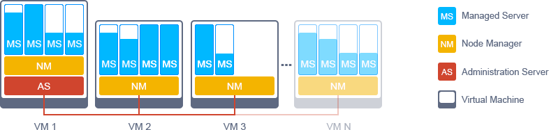
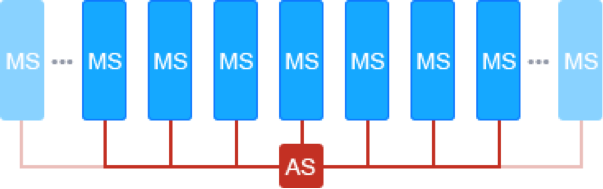

# WebLogic Cluster
Autoscalable and Highly Available Oracle WebLogic Cluster

### Default Topology in VMs 
WebLogic Server consists of three main kinds of instances required for running in VM:
- Administration Server 
- Node Manager 
- Managed Server

Administration Server is the central point from which you configure and manage all resources in the cluster. It is connected to Node Managers that are responsible for adding and removing Managed Server instances. Managed Servers host web applications, EJBs, web services and other resources.

Usually each VM hosts one Node Manager and several Managed Servers inside. As well as one Administration Server is used for managing all instances across many VMs.

### Decomposed Topology in Containers  

With containers we can get rid of Node Manager role, as it was designed as a VM agent to add and remove Managed Server instances inside its parent VM, because each Managed Server is running inside container and containers are provisioned by orchestration.

After migration to containers such instances can be added / removed  automatically as well as can be directly attached to Administration Server using container orchestration platform and a set of WSLT scripts.

### Migration services from VMs to Containers

For more details please <a href='mailto:info@jelastic.com'>contact us</a>. 

