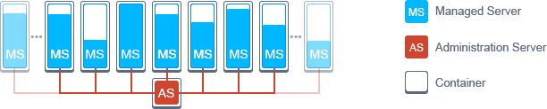

# WebLogic Cluster
Auto-scalable and highly-available Oracle WebLogic Cluster on top of containers

### Default Cluster Topology in VMs 
WebLogic Server consists of three main kinds of instances, required for running in VM:
- _Administration Server_ - the central point you can configure and manage all cluster resources through
- _Node Manager(s)_ - are responsible for adding and removing Managed Server instances
- _Managed Server(s)_ - are used to host web applications, EJBs, web services and other resources.

Usually, each VM handles one _Node Manager_ and several _Managed Servers_ inside. Herewith, a single _Administration Server_ is used for managing all of these instances within multiple VMs.

### Decomposed Topology in Containers  

Deploying your Weblogic Cluster on top of containers instead of VMs implies running each _Managed Server_ inside a separate isolated container, whilst containers themselves are provisioned by orchestration. This allows to get rid of the _Node Manager_ instances (since by default they implement the role of VM agent, intended to control the number of _MS_ instances inside parent VM) and get a much more simpler cluster topology.

As a result, upon migration to containers _MS_ instances will be added & removed automatically, where each of them can be attached directly to _Administration Server_ using container orchestration platform and a set of <a href='https://github.com/jelastic-jps/weblogic/tree/master/scripts'>WSLT scripts</a>.

### Migration Services from VMs to Containers

Due to the described above, moving your Weblogic Cluster to containers will result in increased performance and better resources utilization. Among other benefits, with this solution you can: 
- eliminate the necessity to reserve resources in advance (as Jelastic infrastructure ensures automatic <a href='https://docs.jelastic.com/automatic-vertical-scaling'>vertical</a> and <a href='https://docs.jelastic.com/automatic-horizontal-scaling'>horizontal</a> scaling of containers, with no restart and downtime)
- run different application types in separate containers with advanced isolation
- simplify configurations and achieve easier cluster management due to removing the Node Manager element
- move your project across different hardware (provisioned by means of different <a href='https://docs.jelastic.com/environment-regions'>environment regions</a> within a single platform), or even between different clouds and/or vendors thanks to the advanced containers’ portability

In case you’d like to deploy your own clustered Weblogic solution on top of containers inside Jelastic, please <a href='mailto:info@jelastic.com'>contact us</a> to get our technical experts’ assistance.
